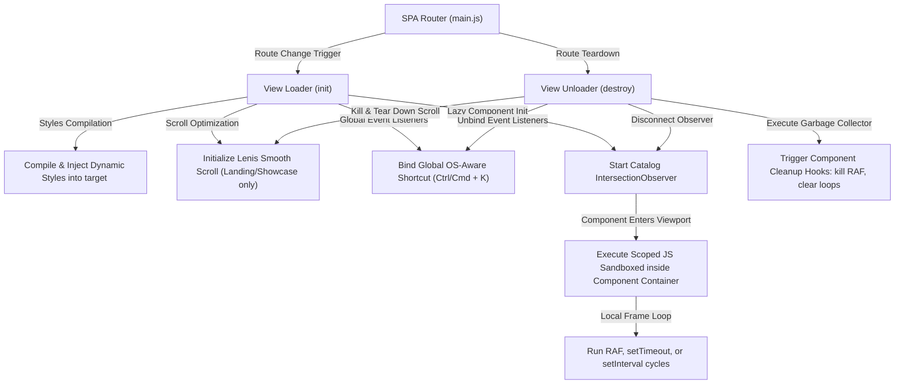

# SnippetUI — Premium CSS & HTML Components Library

<div align="center">
  

  <h3>State-of-the-Art Vanilla Web & Tailwind CSS Components</h3>

  <p align="center">
    A high-performance component catalog engineered with zero framework overhead. Fully interactive, hardware-accelerated, copy-paste ready HTML, Vanilla CSS, Tailwind utility structures, JavaScript, and TypeScript snippets.
  </p>

  <p align="center">
    <a href="https://vite.dev"></a>
    
    <a href="LICENSE"></a>
  </p>
</div>

---

## ⚡ Key Architectural Highlights

SnippetUI is designed by and for senior frontend engineers who demand visual perfection and performance optimization. 

### 1. Zero-Framework Runtime Architecture
Unlike traditional component libraries built on heavy React, Vue, or Svelte wrappers, SnippetUI's core library runs entirely on native **Web APIs, ES Modules, and Vanilla CSS**. This architecture ensures:
* **Zero Main-Thread Bloat:** No virtual DOM reconciliation, hydration overhead, or framework bundles.
* **Universal Portability:** Drop component code directly into Webflow, Shopify, WordPress, Svelte, Angular, React, Next.js, or raw HTML files.
* **Peak FPS Performance:** Animation layers are written using GPU-promoted layout triggers (`transform`, `opacity`, `will-change`) bypassing the browser layout/reflow steps.

### 2. High-Performance SPA Routing & Lifecycle Sandbox
SnippetUI employs a custom client-side SPA routing engine designed to manage dynamic resource rendering without memory leaks:
* **Dynamic Style Injection:** CSS files for components are consolidated and injected into a single dynamic `<style>` block (`snippetui-dynamic-components-styles`), maintaining zero-render layout-thrashing prevention.
* **Intersection-Observed Execution:** Scripts for interactive grid components are lazily bound via an `IntersectionObserver`. Scoped JavaScript only executes when components enter the viewport, saving CPU cycles.
* **Automated Garbage Collection:** During page routing transitions, the unloader framework triggers hook cleanups, stripping registered event listeners (`Ctrl/Cmd+K` keydowns), halting `requestAnimationFrame` loops, and clearing intervals to avoid memory leaks.

### 3. Integrated Lenis Inertia Scroll
We use the **Lenis smooth scrolling engine** to optimize interactive scroll pipelines.
* For marketing showcases (morphing scroll timelines, sticky Glassmorphic Sandboxes), Lenis coordinates fluid inertial scrolling.
* During catalog transitions, Lenis is dynamically detached and suspended. This ensures standard, native document scrolling heights and eliminates scroll-spy viewport conflicts within the complex search filters list.

### 4. Dynamic Multi-Framework Transpilation Engine
SnippetUI features a robust client-side transpiler that translates core component definitions into custom wrappers:
* **React & SolidJS Output:** Converts classes to `className`/`class` attributes, parses inline style properties to JSX object structures, closes self-closing elements, and binds JavaScript logic inside lifecycle hooks (`useEffect`/`onMount`) using container-scoped query scopes to avoid global collision. Supports class-to-scoping mappings for **CSS Modules** compilation.
* **Vue 3 & Svelte Output:** Packages scripts, markup, and scoped stylesheets into Single File Components (`.vue` / `.svelte`).
* **Format Flexibility:** Instantly switches between JavaScript and TypeScript syntax, as well as Vanilla CSS, Tailwind CSS, and CSS Modules layouts.

### 5. Client-Side Fuzzy Search & Dynamic Performance Tagging
SnippetUI incorporates a lightning-fast client-side fuzzy search engine (powered by a subsequence letter matching algorithm) coupled with automated performance classification tags:
* **Fuzzy Matching:** Matches query patterns with a character distance penalty and consecutive letters bonus (e.g. searching `"mgb"` matches *Magnetic Gravity Button*).
* **Automated Component Tagging:**
  * `[GPU]`: Identifies 100% hardware-accelerated animations (using `transform`/`opacity` transitions).
  * `[Pure CSS]`: Scans code for zero JavaScript runtime dependencies.
  * `[Interactive]`: Classifies complex hover and cursor-coordinate tracking scripts.

### 6. Zero-Dependency Multi-Language (i18n) Engine
Built from scratch to optimize SEO indexing and localization across the globe:
* **Supported Languages:** English (`en`), Spanish (`es`), French (`fr`), German (`de`), Japanese (`ja`), and Chinese (`zh`) (excluding Hindi).
* **Session Persistence:** Selections are saved cross-session in local browser cache.
* **Native Select Controls:** Custom glassmorphic dropdowns in the navbar and library headers feature native name options (`English`, `Español`, `Français`, `Deutsch`, `日本語`, `简体中文`) to enable smooth, localized navigations.

### 7. Multi-Framework Micro-Bundles (1-Click ZIP Downloader)
To minimize developer friction to zero seconds, SnippetUI compiles components across all supported frameworks and packages them into a ZIP archive entirely in the browser:
* **Pure Client-Side Bundling:** Uses a custom uncompressed Store ZIP encoder written in pure JS (utilizing custom CRC-32 hashing and DOS timestamp parsing) to bypass heavy server operations and network delays.
* **Cross-Framework Package:** Each bundle contains raw HTML/CSS/JS, React JSX, React TSX, Vue 3, Svelte, and SolidJS implementations, alongside a customized integration `README.md` guide.

### 8. Production-Grade CodeQL Security Hardening
SnippetUI adheres to strict enterprise-grade security and vulnerability standards. The repository is audited and hardened:
* **XSS Prevention:** Zero usage of unescaped user inputs in dynamic contexts. All terminal simulations and DOM updates employ strict character escaping pipelines.
* **Safe Template Parsing:** Replaced all regex comment-stripping patterns with iterative substring scanners to prevent RegExp Denial of Service (ReDoS) and parser bypasses during code compilation.
* **Clean CodeQL Scans:** Maintains a 100% clean check status in GitHub Actions CodeQL security and quality scans.

---

## 📐 Application Architecture & Routing Pipeline

The diagram below maps out how the navigation router, dynamic style injector, sandbox controller, and Lenis engine interact to provide seamless SPA transitions and leak-proof garbage collection:



---

## 📂 Component Registry Database Explorer

Below is the directory mapping of the hundreds of premium UI layouts, components, and animations cataloged within SnippetUI.

<details>
<summary><b>💬 Text Animations (50 Components)</b></summary>

* **Holographic & Fluid:** Aurora Holographic Text, Rainbow Fluid, Liquid Water Text, Liquid Jelly, Aurora Shimmer, Volcano Blast, Cosmic Nebula.
* **Matrix & Cyberpunk:** Cyberpunk Glitch Text, Neon Matrix, Cyber Echo, Cyber Scrambler, Binary Rain.
* **Kinetic & Dynamic:** Text Pressure Breath, Kinetic Float, Split Reveal Text, Split Text, Blur Text, Circular Text, Shuffle Text, Falling Text, True Focus, Laser Sweep.
* **Creative & Retro:** Retro Synthwave, Retro Laser, Neon Glow, Typing Terminal, Burning Fire, Perspective 3D, Sound Wave, Origami Fold, Smoke Vortex.
</details>

<details>
<summary><b>🔘 Buttons (35 Components)</b></summary>

* **Magnetic & Gravity:** Magnetic Gravity, Magnetic Ferrofluid, Magnetic Compass, Magnetic Flux.
* **Chroma & Refraction:** Chroma Vortex, Chroma Split, Chroma Refraction.
* **Volcanic & Cosmic:** Volcanic Magma, Cosmic Portal, Nebula Cloud.
* **Glow & Cyber:** Neon Border, Cyber Glitch, Cyber Matrix, CRT Terminal, Laser Slash.
* **Fluid & Elastic:** Liquid Gradient, Glass Fluid, Mercury Ripple, Jelly Elastic, Liquid Bubble.
</details>

<details>
<summary><b>🎴 Cards (25 Components)</b></summary>

* **Refractive & Parallax:** Magnetic Parallax, Glass Fluid, Luxury Gold, Holo Ticket, Chroma Prism.
* **Cyber & Arcade:** Cyber Glitch, Virtual Cyber Grid, Cyber Sonic, Cyber Synapse, Retro Arcade.
* **Organic & Ethereal:** Biolume Moss, Ethereal Smoke, Firefly Drift, Ice Frost, Volcanic Lava, Star Constellation.
</details>

<details>
<summary><b>⌨️ Interactive Inputs (25 Components)</b></summary>

* **Dynamic Labels & Focus:** Float Label Input, Glass Bubble, Luxury Gold, Magnetic Gravity.
* **Cyber & Terminal:** Cyber Glitch, CRT Terminal, Laser Slash, Matrix Rain, Holo Ticket, Quantum Resonance.
* **Volcanic & Smoke:** Volcanic Magma, Mercury Ripple, Biolume Moss, Ethereal Smoke, Sonic Amplitude.
</details>

<details>
<summary><b>🎚️ Sliders & Ranges (25 Components)</b></summary>

* **Interactive Gauges:** Liquid Thermometer Range, Gravity Magnet, Cyber Glitch, Volcanic Lava, DNA Helix, Acoustic Wave, Neural Synapse, Supernova Blast, CRT Terminal.
</details>

<details>
<summary><b>📂 Dropdowns & Menus (25 Components)</b></summary>

* **Radial & Accordion:** Retro Hologram Radial Menu, Gooey Liquid Accordion, Aurora Cascading Dropdown, Circular Orbital Dial, Origami Geometric Accordion, Bioluminescent Moss, CRT Terminal Command Menu.
</details>

<details>
<summary><b>🎬 Page Transitions (10 Components)</b></summary>

* **Immersive Sweeps:** Scroll Stack, Liquid Wave Sweep, Cyber Scrambler, Star Constellation, Luxury Silk Scroll, DNA Helix, Origami Geometric.
</details>

<details>
<summary><b>🗂️ Tabs & Navigation (30 Components)</b></summary>

* **Navigation Blocks:** Liquid Mercury Slideline, Magnetic Gravity Nav, Stepper Timeline Progress, Magnetic Mac Dock, Vertical Cyber Sidebar, Bipolar Split Sidebar, Origami 3D Carousel, Stacked Parallax Tabs.
</details>

<details>
<summary><b>📊 Progress Indicators & Gauges (25 Components)</b></summary>

* **State Visualization:** Liquid Magma Thermometer, Star Constellation Progress, Quantum Wave Gauge, Cyber Grid Radial, Ethereal Smoke Gauge, CRT Radar, Steam Pressure Boiler.
</details>

<details>
<summary><b>⏳ Loaders (25 Components)</b></summary>

* **Creative Loading loops:** Cosmic Vortex, Liquid Mercury, DNA Helix, Soundwave Aura, Quantum Orbital, Biolume Neural, Firefly Swarm, Matrix Rain, Chroma Split, Laser Sweep.
</details>

<details>
<summary><b>🌌 Background Animations (7 Components)</b></summary>

* **Canvas Networks:** Quantum Particle Plexus, Glossy Physics Balls, Cyber Grid Matrix, Interactive Lightning Plasma, Holo Wave Interference, Liquid Glass Metaballs, Vector Field Swarm.
</details>

<details>
<summary><b>🎮 Dock & Sidebar Navigations (40 Components)</b></summary>

* **Context Controllers:** Xbox Inspired Dock, Steam Like Dock, Netflix Style Dock, Glassmorphism Dock, Minimalist Dev Dock, Cyberpunk Sidebar, AI Powered Sidebar, Elegant Luxury Sidebar.
</details>

<details>
<summary><b>🔲 Containers & Layouts (30 Components)</b></summary>

* **Structure Templates:** Fluid Container, Max Width Container, Hero Container, Glassmorphism Container, Stripe SaaS Dashboard Layout, Apple Dashboard System, executive Leadership Dashboard.
</details>

---

## 🛠️ Component File Schema (Developer Specification)

To maintain standard interfaces across all UI components, SnippetUI follows a strict modular object definition schema:

```javascript
/**
 * Component Specification Schema
 * Location: src/library/[category]/[component-id].js
 */
export const component = {
  id: 'kinetic-gravity-button',        // Unique lowercase slug
  name: 'Kinetic Gravity Button',     // User-friendly presentation title
  category: 'buttons',                // Target registry folder name
  tag: 'Interactive',                 // Meta tags ('Kinetic', 'Glassmorphism', etc.)
  
  // Clean, semantic HTML structure containing styling classes
  html: `
    <button class="gravity-btn">
      <span class="gravity-btn-glow"></span>
      <span class="gravity-btn-text">Interact</span>
    </button>
  `,

  // Core vanilla CSS including hardware animations, backdrop-filters, custom themes
  css: `
    .gravity-btn {
      position: relative;
      background: rgba(255, 255, 255, 0.05);
      border: 1px solid rgba(255, 255, 255, 0.1);
      transition: transform 0.2s cubic-bezier(0.25, 1, 0.5, 1);
    }
  `,

  // Optimized Tailwind counterpart utility code
  tailwind: `
    <button class="relative bg-white/5 border border-white/10 transition-transform duration-200 ease-out">
      Interact
    </button>
  `,

  // Scoped JavaScript event loop, runs isolated inside DOM container context
  js: `
    const btn = document.querySelector('.gravity-btn');
    if (btn) {
      btn.addEventListener('mousemove', (e) => {
        const { clientX, clientY } = e;
        // Calculation logic here...
      });
    }
  `,

  // Typed TS counterpart configuration
  ts: `
    const btn = document.querySelector<HTMLButtonElement>('.gravity-btn');
    if (btn) {
      btn.addEventListener('mousemove', (e: MouseEvent) => {
        // Safe typed code execution
      });
    }
  `,

  // AI engineering generation prompt context
  prompt: 'Create a high-fidelity glassmorphic button mapping cursor coordinates to spring-based translate thresholds.'
};
```

---

## 🔌 Integration Guides

### Method A: VS Code Extension (Recommended)
Access SnippetUI components directly from your workspace:
1. Open the command palette (`Ctrl + Shift + P` / `Cmd + Shift + P`).
2. Type **`SnippetUI: Insert Component`**.
3. Select your component and styling format (Vanilla CSS vs Tailwind CSS).
4. The extension automatically maps the markup directly to your active cursor position.

### Method B: CLI Toolkit (Developer Command Line Interface)
Initialize workspace configurations, list available components, query parameters details, and inject target compiled wrappers directly from your terminal using our zero-dependency CLI.

To start, run the environment setup wizard:
```bash
npx snippetui@latest init
```

#### Supported CLI Commands:
| Command | Description | Example |
|---|---|---|
| **`init`** | Setup your workspace configurations (`snippetui.config.json`) interactively, choosing styling layouts (Vanilla, Tailwind), scripting target (JS/TS), and framework wrapper outputs. | `npx snippetui@latest init` |
| **`list`** | View all category structures and component indices available in the global registry. | `npx snippetui@latest list` |
| **`info <id>`** | Inspect metadata details for a component, including categories, tags, description, and list of configurable CSS custom variables. | `npx snippetui@latest info mercury-ripple-btn` |
| **`add <id>`** | Inject a component into your local workspace. Automatically compiles target wrappers (React, Vue, Svelte, Solid), downloads asset files, and patches local `tailwind.config.*` keyframes/animations. | `npx snippetui@latest add mercury-ripple-btn` |
| **`doctor`** | Run diagnostic integrity audits on configurations, destination folders, dependencies, and Tailwind setups. | `npx snippetui@latest doctor` |
| **`update`** | Synchronize local components database index with the remote registry repository files. | `npx snippetui@latest update` |
| **`login`** | Authenticate locally using the secure auth token handshake protocol. | `npx snippetui@latest login` |

*(Compatible with `npm exec`, `npx`, `yarn dlx`, and `bunx`)*

### Method C: Manual Integration & ZIP Micro-Bundles
1. Browse the component inside the library interface.
2. Tap the **Bundle ZIP** button in the header of the detail drawer to download a fully packaged multi-framework bundle ZIP archive containing clean, ready-to-use directories for HTML, React JSX/TSX, Vue, Svelte, and SolidJS.
3. Alternatively, open the **Code** tab inside the detail drawer.
4. Select your target **Framework** (HTML, React, Vue, Svelte, or SolidJS).
5. Select your preferred **Styling** layout (Vanilla CSS, Tailwind CSS, or scoped CSS Modules).
6. Choose your scripting targets (**JavaScript** or type-safe **TypeScript**).
7. Copy the compiled component code blocks directly into your workspace.

---

## 🚀 Getting Started (Development Setup)

### Prerequisites
* **Node.js:** v18.0.0 or higher
* **Package Manager:** `pnpm` (recommended), `npm`, `yarn`, or `bun`

### 1. Installation
Clone the codebase and resolve package dependencies:
```bash
git clone https://github.com/NavishKumar1/Snippetui.git
cd snippetui
npm install
```

### 2. Run Local Development Server
Spin up the Vite server for hot module reloading (HMR) styling tweaks:
```bash
npm run dev
```
Open **`http://localhost:5173/`** to view the interactive gallery dashboard.

### 3. Production Build & Tree-Shaking optimization
Compile the assets for deployment:
```bash
npm run build
```
Vite compiles, treeshakes, and outputs an optimized bundle to the `/dist` directory. This static structure is ready to be hosted directly on static deployment pipelines (Netlify, Vercel, Cloudflare Pages, Github Pages, or custom AWS S3 buckets).

---

## 📄 License
Licensed under the [MIT License](LICENSE). 
Created and engineered by Navish Kumar.
