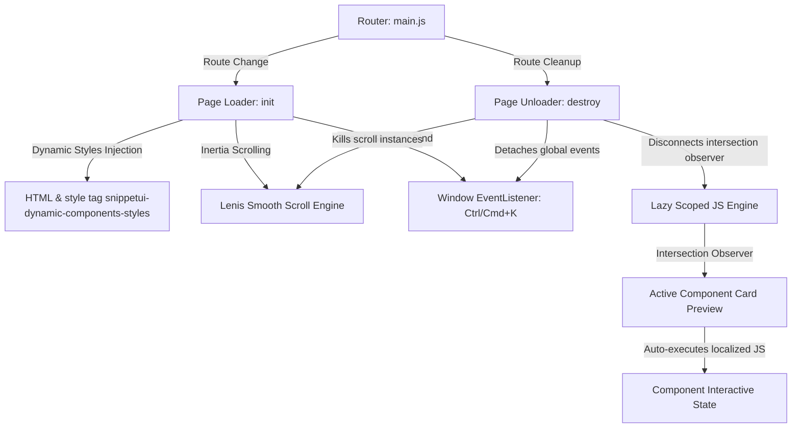

# SnippetUI — Premium CSS & HTML Components Library

[](https://vite.dev)
[](/public/site.webmanifest)
[](LICENSE)

SnippetUI is a state-of-the-art, interactive component library designed for high-performance frontend engineering. It features copy-paste ready HTML, Vanilla CSS, Tailwind utility templates, JavaScript, and TypeScript snippets crafted to bring modern user interfaces to life.

---

## 🌟 Key Highlights

### ⚡ Vercel-Style Sticky Morphing Pipeline
The "How It Works" pipeline uses a **2-column sticky scrolling layout**. As you scroll down:
* The left-hand **Glassmorphic Sandbox** viewport cross-fades and morphs through interactive development states (Autocomplete query typing ➡️ syntax-highlighted IDE mockup with physical copy feedback ➡️ spring-bounced preview button injection).
* The right-hand step cards track vertical scroll progress using dynamically calculated CSS custom properties (`--scroll-progress`) applied to active neon timeline borders.

### 🔍 Global Search & OS-Aware Keyboard Shortcut
* Tap `Ctrl + K` (Windows/Linux) or `⌘ + K` (macOS) globally inside the library page to focus the search bar.
* The search input placeholder dynamically adapts to show the correct combination depending on the user's platform.
* Automatically selects existing text on trigger for instant query refinement.

### 🌐 High-Performance Router & Smooth Scroll
* **Lenis Integration**: Incorporates smooth inertial scrolling for both landing section anchors and individual sub-panels, avoiding layout scroll conflicts.
* **SPA Routing Engine**: Page navigation triggers smooth fade-and-translate transitions with dynamic title rendering (e.g. `Components Library | SnippetUI`) for SEO compliance.
* **Resource Cleanup Lifecycle**: Registered global keydown listeners, intersection observers, and animations are automatically garbage-collected during page transition triggers to avoid memory leaks.

### ⚙️ Production-Grade Favicon & PWA Suite
* Uses a scalable vector SVG favicon (`/favicon.svg`) ensuring pixel-perfect rendering across modern devices and high-DPI displays.
* Integrated `apple-touch-icon`, `site.webmanifest`, and theme color configurations matching the dark visual aesthetic.

---

## 📐 Application Architecture

The diagram below outlines how the single-page routing engine, dynamic style injection, and sandboxed component execution interlock:



---

## 📂 Project Structure

```
snippetui2/
├── public/
│   ├── favicon.svg             # HD Vector logo
│   ├── site.webmanifest        # PWA setup
│   └── assets/
│       └── logo.png            # Raster marketing assets
├── src/
│   ├── library/                # Scoped component database (JS/CSS)
│   ├── error404.js             # Fallback route view
│   ├── extension.js            # VS Code Showcase page
│   ├── landing.js              # Landing page (Pipeline & FAQ controllers)
│   ├── library.js              # Library layout, filter & event loops
│   ├── main.js                 # App entrypoint, capsule navbar scroll-spy & router
│   ├── privacy.js              # Privacy terms page template
│   ├── terms.js                # Terms of Service page template
│   └── style.css               # Global tokens, glassmorphism & responsive layout overrides
├── vscode-extension/           # Visual Studio Code Companion Integration
├── index.html                  # Core HTML5 entry with meta SEO configurations
└── package.json                # Dependency manifest
```

---

## 🚀 Getting Started

### Prerequisites
* [Node.js](https://nodejs.org/) (Version 18+ recommended)
* A modern browser supporting ES Modules and CSS backdrop-filters.

### 1. Installation
Clone this repository to your workspace and install dependencies:
```bash
npm install
```

### 2. Local Development
Run the Vite local development server:
```bash
npm run dev
```
Open `http://localhost:5173/` in your browser.

### 3. Production Compilation
Bundle the application for production hosting:
```bash
npm run build
```
Vite will compile and optimize all assets into the `/dist` folder. You can deploy this folder directly to static hosting services like **Vercel, Netlify, Cloudflare Pages, or GitHub Pages**.

---

## 🔌 VS Code Extension Companion
The project features a Visual Studio Code integration workspace inside `/vscode-extension`. This allows developers to query the SnippetUI library directly from their editor command palette and auto-inject HTML and CSS components into active workfiles.
* To run the extension locally, open `/vscode-extension` in VS Code and launch the extension debugging task (`F5`).

---

## 📄 License
This platform is open-source software licensed under the [MIT License](LICENSE).
